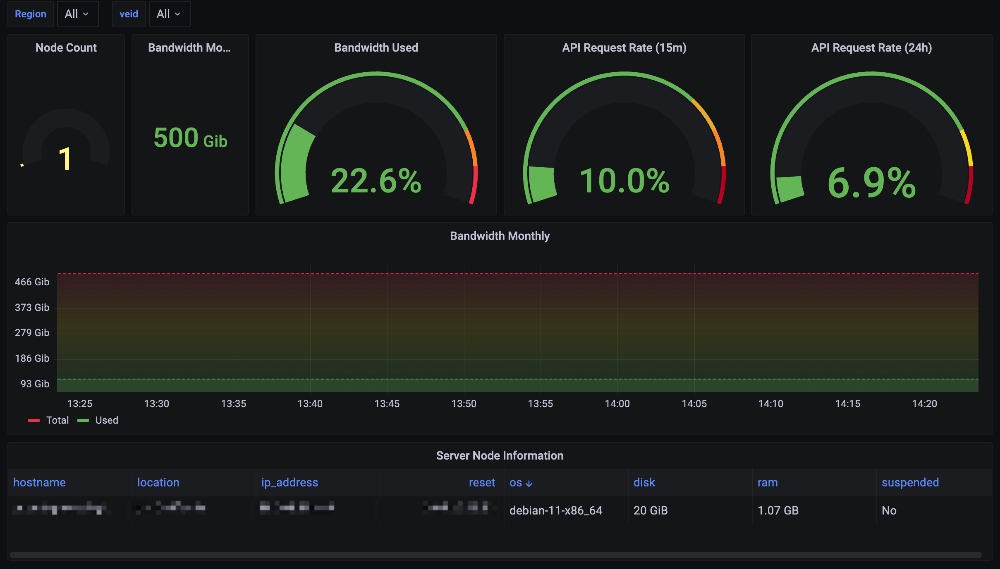

# Bandwagon exporter

A Prometheus Exporter for BandwagonHost KiwiVM. Inspired from [bandwagonhost_cloud_exporter](https://github.com/weiqiang333/bandwagonhost_cloud_exporter) by Go language.

## Usage

Start the binary with `-h` to get the complete syntax. The parameters are:

| Parameter | Required | Valid values | Default | Description |
| -- | -- | -- | -- | -- |
| `-c`<br />`--config-path` | yes | *.json/yaml/toml | | Config path, see [examples](config/).
| `-m`<br />`--metrics-server` | no | HOST:PORT | 0.0.0.0:9103 | Specify the serivce with port. This is the target your Prometheus instance should point to.
| `--metrics-path` | no | URI Path | /metrics | This is the path of URI, must starts with `/` char.

Once started, the tool will listen on the specified port (or the default one, 9103, if not specified) and return a Prometheus valid response at the url `/metrics`. So to check if the tool is working properly simply browse the `http://0.0.0.0:9103` (or whichever address with port you choose).

## Deopy

### Docker

```bash
docker run --name bandwagon-exporter \
  -p 9103:9103 \
  -v /etc/bandwagon/config.yml:/etc/bandwagon/config.yml \
  ghcr.io/icyleaf/bandwagon-exporter:snapshot \
  --config-path=/etc/bandwagon/config.yml
```

### Docker Compose

```yaml
version: "3"
services:
  bandwagon-exporter:
    restart: unless-stopped
    image: ghcr.io/icyleaf/bandwagon-exporter:snapshot
    command:
      - '--config-path=/etc/bandwagon/config.yml'
    volumes:
      - ./config/config.yml:/etc/bandwagon/config.yml
    ports:
      - "9103:9103"
```

## Prometheus Metrics

```text
# HELP bandwagon_api_rate_limit_remaining_points_15min API rate limit number of 'points' available to use in the current 15-minutes interval
# TYPE bandwagon_api_rate_limit_remaining_points_15min gauge
bandwagon_api_rate_limit_remaining_points_15min{veid="1234567"} 900
# HELP bandwagon_api_rate_limit_remaining_points_24h API rate limit number of 'points' available to use in the current 24-hour interval
# TYPE bandwagon_api_rate_limit_remaining_points_24h gauge
bandwagon_api_rate_limit_remaining_points_24h{veid="1234567"} 19900
# HELP bandwagon_api_request_total The total of request bandwagon API since run this CLI
# TYPE bandwagon_api_request_total counter
bandwagon_api_request_total{veid="1234567"} 22
# HELP bandwagon_data_counter Data transfer used in the current billing month (bytes).
# TYPE bandwagon_data_counter gauge
bandwagon_data_counter{hostname="hostname",ip_address="1.2.3.4"} 112214184728
# HELP bandwagon_data_next_reset Date and time of transfer counter reset (UNIX timestamp)
# TYPE bandwagon_data_next_reset gauge
bandwagon_data_next_reset{hostname="hostname",ip_address="1.2.3.4"} 1666319224
# HELP bandwagon_node_info Node information
# TYPE bandwagon_node_info gauge
bandwagon_node_info{disk="21474836480",hostname="hostname",ip_address="1.2.3.4",location="US, California",os="debian-11-x86_64",plan="kvmv3-20g-1g-500g-ca-cn2gia-dc9",ram="1073741824",suspended="0",swap="0",vm_type="kvm"} 1
# HELP bandwagon_plan_monthly_data Allowed monthly data transfer (bytes)
# TYPE bandwagon_plan_monthly_data gauge
bandwagon_plan_monthly_data{hostname="hostname",ip_address="1.2.3.4"} 536870912000
```

### Grafana Dashboard



## Using Dashboard ID

Dashboard ID: `17089`

> [How do I import this dashboard?](https://grafana.com/docs/grafana/latest/dashboards/export-import/#import-dashboard)

## Using JSON data

<details>
  <summary>View JSON Data</summary>

```json
{
  "annotations": {
    "list": [
      {
        "builtIn": 1,
        "datasource": {
          "type": "grafana",
          "uid": "-- Grafana --"
        },
        "enable": true,
        "hide": true,
        "iconColor": "rgba(0, 211, 255, 1)",
        "name": "Annotations & Alerts",
        "target": {
          "limit": 100,
          "matchAny": false,
          "tags": [],
          "type": "dashboard"
        },
        "type": "dashboard"
      }
    ]
  },
  "editable": true,
  "fiscalYearStartMonth": 0,
  "graphTooltip": 0,
  "id": 3,
  "links": [],
  "liveNow": false,
  "panels": [
    {
      "datasource": {
        "type": "prometheus",
        "uid": "HfdV9N44z"
      },
      "description": "",
      "fieldConfig": {
        "defaults": {
          "color": {
            "mode": "continuous-YlRd"
          },
          "mappings": [],
          "thresholds": {
            "mode": "percentage",
            "steps": [
              {
                "color": "green",
                "value": null
              },
              {
                "color": "orange",
                "value": 70
              },
              {
                "color": "red",
                "value": 85
              }
            ]
          }
        },
        "overrides": []
      },
      "gridPos": {
        "h": 6,
        "w": 3,
        "x": 0,
        "y": 0
      },
      "id": 4,
      "options": {
        "orientation": "auto",
        "reduceOptions": {
          "calcs": [
            "lastNotNull"
          ],
          "fields": "",
          "values": false
        },
        "showThresholdLabels": false,
        "showThresholdMarkers": true
      },
      "pluginVersion": "9.1.6",
      "targets": [
        {
          "datasource": {
            "type": "prometheus",
            "uid": "HfdV9N44z"
          },
          "editorMode": "code",
          "expr": "count(bandwagon_node_info)",
          "format": "time_series",
          "legendFormat": "__auto",
          "range": true,
          "refId": "A"
        }
      ],
      "title": "Node Count",
      "type": "gauge"
    },
    {
      "datasource": {
        "type": "prometheus",
        "uid": "HfdV9N44z"
      },
      "fieldConfig": {
        "defaults": {
          "color": {
            "mode": "thresholds"
          },
          "mappings": [],
          "thresholds": {
            "mode": "absolute",
            "steps": [
              {
                "color": "dark-red",
                "value": null
              },
              {
                "color": "green",
                "value": 5
              }
            ]
          }
        },
        "overrides": [
          {
            "matcher": {
              "id": "byType",
              "options": "number"
            },
            "properties": [
              {
                "id": "unit",
                "value": "bits"
              }
            ]
          }
        ]
      },
      "gridPos": {
        "h": 6,
        "w": 3,
        "x": 3,
        "y": 0
      },
      "id": 6,
      "options": {
        "colorMode": "value",
        "graphMode": "none",
        "justifyMode": "auto",
        "orientation": "auto",
        "reduceOptions": {
          "calcs": [
            "lastNotNull"
          ],
          "fields": "",
          "values": false
        },
        "textMode": "auto"
      },
      "pluginVersion": "9.1.6",
      "targets": [
        {
          "datasource": {
            "type": "prometheus",
            "uid": "HfdV9N44z"
          },
          "editorMode": "code",
          "expr": "sum(bandwagon_plan_monthly_data{hostname=~\"$region.*\"})",
          "legendFormat": "__auto",
          "range": true,
          "refId": "A"
        }
      ],
      "title": "Bandwidth Monthly",
      "type": "stat"
    },
    {
      "datasource": {
        "type": "prometheus",
        "uid": "HfdV9N44z"
      },
      "fieldConfig": {
        "defaults": {
          "color": {
            "mode": "thresholds"
          },
          "mappings": [],
          "max": 1,
          "min": 0,
          "thresholds": {
            "mode": "absolute",
            "steps": [
              {
                "color": "green",
                "value": null
              },
              {
                "color": "orange",
                "value": 0.8
              },
              {
                "color": "red",
                "value": 0.9
              }
            ]
          },
          "unit": "percentunit"
        },
        "overrides": []
      },
      "gridPos": {
        "h": 6,
        "w": 6,
        "x": 6,
        "y": 0
      },
      "id": 14,
      "options": {
        "orientation": "horizontal",
        "reduceOptions": {
          "calcs": [
            "lastNotNull"
          ],
          "fields": "",
          "values": false
        },
        "showThresholdLabels": false,
        "showThresholdMarkers": true,
        "text": {}
      },
      "pluginVersion": "9.1.6",
      "targets": [
        {
          "datasource": {
            "type": "prometheus",
            "uid": "HfdV9N44z"
          },
          "editorMode": "code",
          "expr": "bandwagon_data_counter{hostname=~\"$region.*\"} / bandwagon_plan_monthly_data{hostname=~\"$region.*\"}",
          "legendFormat": "",
          "range": true,
          "refId": "A"
        }
      ],
      "title": "Bandwidth Used",
      "type": "gauge"
    },
    {
      "datasource": {
        "type": "prometheus",
        "uid": "HfdV9N44z"
      },
      "description": "",
      "fieldConfig": {
        "defaults": {
          "color": {
            "mode": "thresholds"
          },
          "mappings": [],
          "max": 1,
          "min": 0,
          "thresholds": {
            "mode": "absolute",
            "steps": [
              {
                "color": "green",
                "value": null
              },
              {
                "color": "#EAB839",
                "value": 0.7
              },
              {
                "color": "orange",
                "value": 0.8
              },
              {
                "color": "dark-red",
                "value": 0.9
              }
            ]
          },
          "unit": "percentunit"
        },
        "overrides": []
      },
      "gridPos": {
        "h": 6,
        "w": 6,
        "x": 12,
        "y": 0
      },
      "id": 10,
      "options": {
        "orientation": "auto",
        "reduceOptions": {
          "calcs": [
            "lastNotNull"
          ],
          "fields": "",
          "values": false
        },
        "showThresholdLabels": false,
        "showThresholdMarkers": true,
        "text": {}
      },
      "pluginVersion": "9.1.6",
      "targets": [
        {
          "datasource": {
            "type": "prometheus",
            "uid": "HfdV9N44z"
          },
          "editorMode": "code",
          "expr": "1 - bandwagon_api_rate_limit_remaining_points_15min/max_over_time(bandwagon_api_rate_limit_remaining_points_15min{veid=~\"$veid.*\"}[60m])",
          "legendFormat": "__auto",
          "range": true,
          "refId": "A"
        }
      ],
      "title": "API Request Rate (15m)",
      "type": "gauge"
    },
    {
      "datasource": {
        "type": "prometheus",
        "uid": "HfdV9N44z"
      },
      "description": "",
      "fieldConfig": {
        "defaults": {
          "color": {
            "mode": "thresholds"
          },
          "decimals": 1,
          "mappings": [],
          "max": 1,
          "min": 0,
          "thresholds": {
            "mode": "absolute",
            "steps": [
              {
                "color": "green",
                "value": null
              },
              {
                "color": "yellow",
                "value": 0.8
              },
              {
                "color": "dark-red",
                "value": 0.9
              }
            ]
          },
          "unit": "percentunit"
        },
        "overrides": []
      },
      "gridPos": {
        "h": 6,
        "w": 6,
        "x": 18,
        "y": 0
      },
      "id": 11,
      "options": {
        "orientation": "auto",
        "reduceOptions": {
          "calcs": [
            "lastNotNull"
          ],
          "fields": "",
          "values": false
        },
        "showThresholdLabels": false,
        "showThresholdMarkers": true,
        "text": {}
      },
      "pluginVersion": "9.1.6",
      "targets": [
        {
          "datasource": {
            "type": "prometheus",
            "uid": "HfdV9N44z"
          },
          "editorMode": "code",
          "expr": "1 - bandwagon_api_rate_limit_remaining_points_24h/max_over_time(bandwagon_api_rate_limit_remaining_points_24h{veid=~\"$veid.*\"}[1d])",
          "legendFormat": "__auto",
          "range": true,
          "refId": "A"
        }
      ],
      "title": "API Request Rate (24h)",
      "type": "gauge"
    },
    {
      "datasource": {
        "type": "prometheus",
        "uid": "HfdV9N44z"
      },
      "description": "",
      "fieldConfig": {
        "defaults": {
          "color": {
            "mode": "continuous-GrYlRd",
            "seriesBy": "last"
          },
          "custom": {
            "axisCenteredZero": false,
            "axisColorMode": "text",
            "axisLabel": "",
            "axisPlacement": "auto",
            "barAlignment": 0,
            "drawStyle": "line",
            "fillOpacity": 20,
            "gradientMode": "scheme",
            "hideFrom": {
              "legend": false,
              "tooltip": false,
              "viz": false
            },
            "lineInterpolation": "smooth",
            "lineStyle": {
              "dash": [
                0,
                3,
                3
              ],
              "fill": "dot"
            },
            "lineWidth": 1,
            "pointSize": 6,
            "scaleDistribution": {
              "type": "linear"
            },
            "showPoints": "auto",
            "spanNulls": false,
            "stacking": {
              "group": "A",
              "mode": "none"
            },
            "thresholdsStyle": {
              "mode": "off"
            }
          },
          "decimals": 0,
          "mappings": [],
          "thresholds": {
            "mode": "absolute",
            "steps": [
              {
                "color": "green",
                "value": null
              },
              {
                "color": "red",
                "value": 80
              }
            ]
          },
          "unit": "bits"
        },
        "overrides": []
      },
      "gridPos": {
        "h": 7,
        "w": 24,
        "x": 0,
        "y": 6
      },
      "id": 8,
      "options": {
        "legend": {
          "calcs": [],
          "displayMode": "list",
          "placement": "bottom",
          "showLegend": true
        },
        "tooltip": {
          "mode": "single",
          "sort": "none"
        }
      },
      "targets": [
        {
          "datasource": {
            "type": "prometheus",
            "uid": "HfdV9N44z"
          },
          "editorMode": "code",
          "expr": " bandwagon_plan_monthly_data{hostname=~\"$region.*\"}",
          "hide": false,
          "legendFormat": "Total",
          "range": true,
          "refId": "B"
        },
        {
          "datasource": {
            "type": "prometheus",
            "uid": "HfdV9N44z"
          },
          "editorMode": "code",
          "expr": "sum(bandwagon_data_counter{hostname=~\"$region.*\"})",
          "legendFormat": "Used",
          "range": true,
          "refId": "A"
        }
      ],
      "title": "Bandwidth Monthly",
      "type": "timeseries"
    },
    {
      "datasource": {
        "type": "prometheus",
        "uid": "HfdV9N44z"
      },
      "fieldConfig": {
        "defaults": {
          "color": {
            "mode": "thresholds"
          },
          "custom": {
            "align": "auto",
            "displayMode": "auto",
            "inspect": false
          },
          "mappings": [],
          "thresholds": {
            "mode": "absolute",
            "steps": [
              {
                "color": "green",
                "value": null
              },
              {
                "color": "red",
                "value": 80
              }
            ]
          }
        },
        "overrides": [
          {
            "matcher": {
              "id": "byName",
              "options": "disk"
            },
            "properties": [
              {
                "id": "unit",
                "value": "bytes"
              }
            ]
          },
          {
            "matcher": {
              "id": "byName",
              "options": "ram"
            },
            "properties": [
              {
                "id": "unit",
                "value": "decbytes"
              }
            ]
          },
          {
            "matcher": {
              "id": "byName",
              "options": "suspended"
            },
            "properties": [
              {
                "id": "unit",
                "value": "bool_yes_no"
              }
            ]
          },
          {
            "matcher": {
              "id": "byName",
              "options": "Value #B"
            },
            "properties": [
              {
                "id": "unit",
                "value": "dtdhms"
              }
            ]
          }
        ]
      },
      "gridPos": {
        "h": 4,
        "w": 24,
        "x": 0,
        "y": 13
      },
      "id": 13,
      "options": {
        "footer": {
          "fields": "",
          "reducer": [
            "sum"
          ],
          "show": false
        },
        "showHeader": true,
        "sortBy": [
          {
            "desc": true,
            "displayName": "os"
          }
        ]
      },
      "pluginVersion": "9.1.6",
      "targets": [
        {
          "datasource": {
            "type": "prometheus",
            "uid": "HfdV9N44z"
          },
          "editorMode": "code",
          "exemplar": false,
          "expr": "bandwagon_node_info{hostname=~\"$region.*\"}",
          "format": "table",
          "instant": true,
          "legendFormat": "info",
          "range": false,
          "refId": "A"
        },
        {
          "datasource": {
            "type": "prometheus",
            "uid": "HfdV9N44z"
          },
          "editorMode": "code",
          "exemplar": false,
          "expr": "last_over_time(bandwagon_data_next_reset{hostname=~\"$region.*\"}[60m]) - time()",
          "format": "table",
          "hide": false,
          "instant": true,
          "legendFormat": "reset",
          "range": false,
          "refId": "B"
        }
      ],
      "title": "Server Node Information",
      "transformations": [
        {
          "id": "seriesToColumns",
          "options": {
            "byField": "hostname"
          }
        },
        {
          "id": "organize",
          "options": {
            "excludeByName": {
              "Time 1": true,
              "Time 2": true,
              "Value #A": true,
              "__name__": true,
              "__name__ 1": true,
              "__name__ 2": true,
              "instance 1": true,
              "instance 2": true,
              "ip_address 2": true,
              "job 1": true,
              "job 2": true,
              "os": false,
              "plan": true,
              "swap": true,
              "vm_type": true
            },
            "indexByName": {
              "Time 1": 2,
              "Time 2": 15,
              "Value #A": 14,
              "Value #B": 5,
              "__name__": 19,
              "disk": 8,
              "hostname": 0,
              "instance 1": 3,
              "instance 2": 16,
              "ip_address 1": 4,
              "ip_address 2": 17,
              "job 1": 6,
              "job 2": 18,
              "location": 1,
              "os": 7,
              "plan": 9,
              "ram": 10,
              "suspended": 11,
              "swap": 12,
              "vm_type": 13
            },
            "renameByName": {
              "Value #B": "reset "
            }
          }
        }
      ],
      "type": "table"
    }
  ],
  "schemaVersion": 37,
  "style": "dark",
  "tags": [],
  "templating": {
    "list": [
      {
        "allValue": ".*",
        "current": {
          "selected": false,
          "text": "All",
          "value": "$__all"
        },
        "hide": 0,
        "includeAll": true,
        "label": "Region",
        "multi": false,
        "name": "region",
        "options": [
          {
            "selected": true,
            "text": "All",
            "value": "$__all"
          },
          {
            "selected": false,
            "text": "jp",
            "value": "jp"
          },
          {
            "selected": false,
            "text": "us",
            "value": "us"
          }
        ],
        "query": "jp,us",
        "queryValue": "",
        "skipUrlSync": false,
        "type": "custom"
      },
      {
        "current": {
          "selected": false,
          "text": "All",
          "value": "$__all"
        },
        "datasource": {
          "type": "prometheus",
          "uid": "HfdV9N44z"
        },
        "definition": "label_values(bandwagon_api_rate_limit_remaining_points_15min, veid)",
        "hide": 0,
        "includeAll": true,
        "label": "veid",
        "multi": false,
        "name": "veid",
        "options": [],
        "query": {
          "query": "label_values(bandwagon_api_rate_limit_remaining_points_15min, veid)",
          "refId": "StandardVariableQuery"
        },
        "refresh": 1,
        "regex": "",
        "skipUrlSync": false,
        "sort": 1,
        "type": "query"
      }
    ]
  },
  "time": {
    "from": "now-1h",
    "to": "now"
  },
  "timepicker": {},
  "timezone": "",
  "title": "Bandwagon Dashboard",
  "uid": "3kGTzD44z",
  "version": 26,
  "weekStart": ""
}
```

</details>

